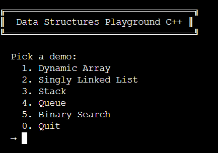
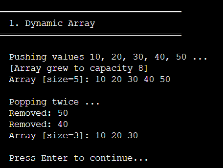
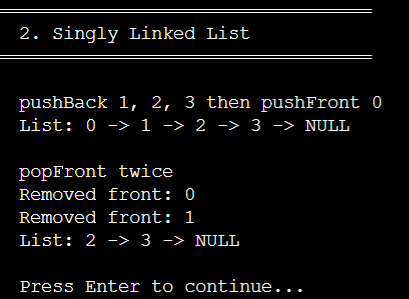
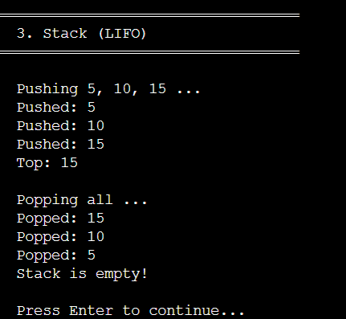
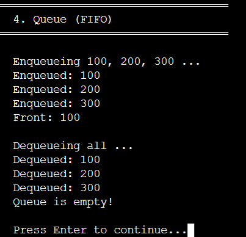
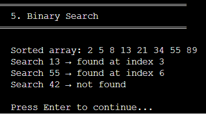
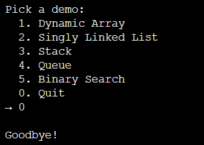

# 🗂️ Data Structures Playground


A beginner-friendly, single-file C++ project that implements and demonstrates the most fundamental data structures and algorithms, complete with an interactive console menu.

---

## 📚 What's Covered

| # | Data Structure / Algorithm | Complexity |
|---|---------------------------|------------|
| 1 | **Dynamic Array** — auto-resizing array | Access O(1) · Push O(1) amortized |
| 2 | **Singly Linked List** — pointer-based list | Push/Pop O(1) front · Traverse O(n) |
| 3 | **Stack (LIFO)** — last in, first out | Push/Pop O(1) |
| 4 | **Queue (FIFO)** — first in, first out | Enqueue/Dequeue O(1) |
| 5 | **Binary Search** — search on sorted array | O(log n) |

---

## 🚀 Getting Started

### Prerequisites

- A C++ compiler that supports **C++17** or later
  - macOS: Xcode Command Line Tools (`xcode-select --install`)
  - Linux: `sudo apt install g++`
  - Windows: [MinGW-w64](https://www.mingw-w64.org/) or [MSVC](https://visualstudio.microsoft.com/)

### Build & Run

```bash
# Clone the repo
git clone https://github.com/your-username/data-structures-cpp.git
cd data-structures-cpp

# Compile
g++ -std=c++17 -o ds data_structures.cpp

# Run
./ds
```

> **Windows:** replace `./ds` with `ds.exe`

---

## 🎮 Usage

Once running, you'll see an interactive menu:

```
╔══════════════════════════════════╗
║  Data Structures Playground C++ ║
╚══════════════════════════════════╝

  Pick a demo:
    1. Dynamic Array
    2. Singly Linked List
    3. Stack
    4. Queue
    5. Binary Search
    0. Quit
  →
```














Select a number to watch the data structure in action with step-by-step output.

---

## 🧠 Concepts Explained

### 1. Dynamic Array
A resizable array that doubles its capacity when full. This is how `std::vector` works under the hood.

```
Push 5 elements into capacity-4 array:
  [Array grew to capacity 8]
  Array [size=5]: 10 20 30 40 50
```

### 2. Singly Linked List
Nodes connected by pointers. Efficient insertion/removal at the front; no pre-allocated memory needed.

```
  List: 0 -> 1 -> 2 -> 3 -> NULL
```

### 3. Stack (LIFO)
Like a stack of plates — you always add and remove from the top. Great for undo/redo, call stacks, and parsing.

```
  Pushed: 15  →  Top: 15
  Popped: 15  →  Top: 10
```

### 4. Queue (FIFO)
Like a line at a checkout — first person in is first person out. Used in scheduling, BFS graph traversal, and buffering.

```
  Enqueued: 100, 200, 300
  Dequeued: 100  →  Front: 200
```

### 5. Binary Search
Efficiently finds a target in a **sorted** array by halving the search space each step.

```
  Search 13 → found at index 3
  Search 42 → not found
```

---

## 📁 Project Structure

```
data-structures-cpp/
├── data_structures.cpp   # All source code (single file)
└── README.md
```

---
